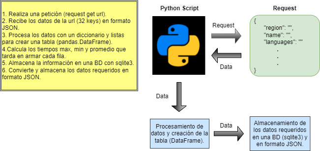

# Tangelo-Test

Este repositorio contiene el desarrollo de una prueba técnica, la cual consiste en:

* De https://restcountries.com/ obtenga el nombre del idioma que habla el pais y encriptelo con SHA1
* En la columna Time ponga el tiempo que tardo en armar la fila (debe ser automatico)
* La tabla debe ser creada en un DataFrame con la libreria PANDAS
* Con funciones de la libreria pandas muestre el tiempo total, el tiempo promedio, el tiempo minimo y el maximo que tardo en procesar toda las filas de la tabla.
* Guarde el resultado en sqlite.
* Genere un Json de la tabla creada y guardelo como data.json
* La prueba debe ser entregada en un repositorio git.

| Region | City Name | Languaje | Time |
|--------|-----------|-----------|-----------|
| Africa | Angola    | AF4F4762F9BD3F0F4A10CAF5B6E63DC4CE543724 | 0.23 ms |

## Contenido:
* `test.py`: Script principal que contiene todo el proceso de obtención de datos, procesamiento y almacenamiento.
* `util.py`: Contiene funciones de uso frecuente.
* `data.json`: Contiene los datos procesados en formato JSON.
* `dountries_db.db`: Base de datos con la información obtenida.
* Test folder:
  * `Tangelo_Test.ipynb`: Script creado para revisar y validar el funcionamiento del programa.
  * `getting_data.py`: Contiene el procedimiento para obtener los datos.
  * `making_dataframe.py`: Contiene el procedimiento para crear el DataFrame.
  * `storing_db.py`: Contiene el procedimiento para guardar los datos en la BD.
  * `to_json.py`: Contiene el procedimiento para guardar los datos en formato JSON.

## Diagrama del procedimiento:

Nota: Al ejecutar el script principal `test.py` se podrá visualizar la tabla creada junto con los tiempos max, min y promedio que tarda en crear una fila, además se guardaran los datos en una BD creada `countries_db.db` y en formato JSON `data.json`.
